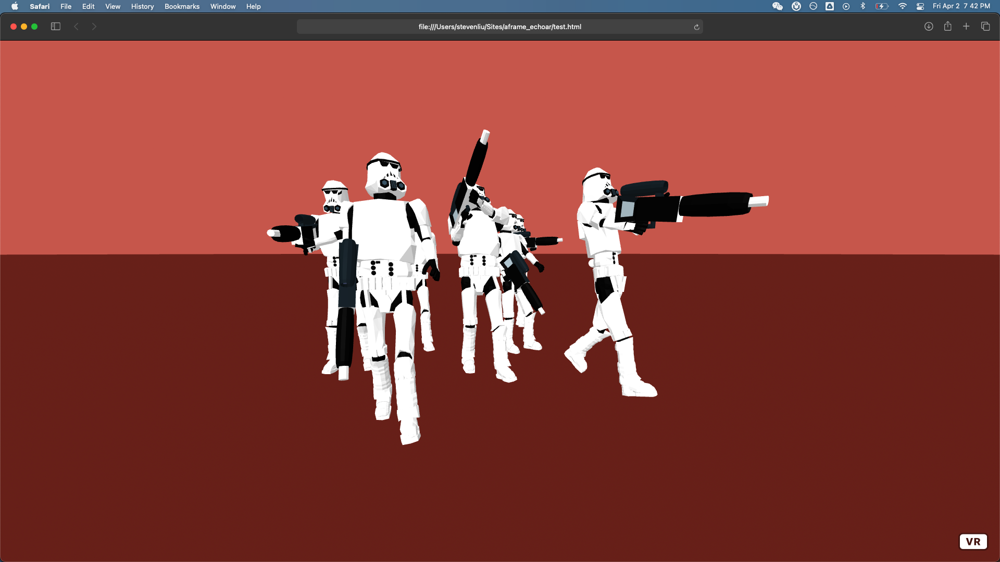
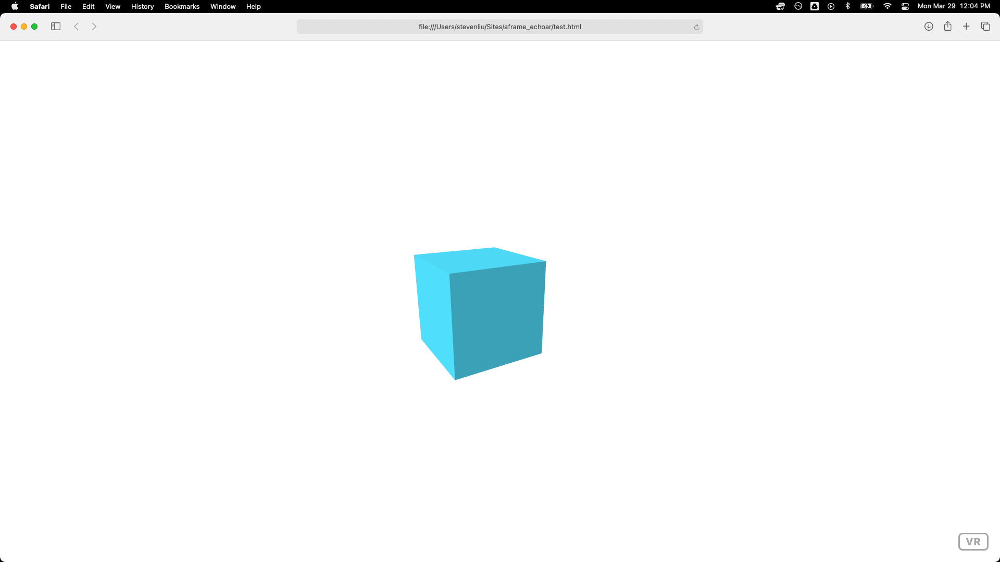
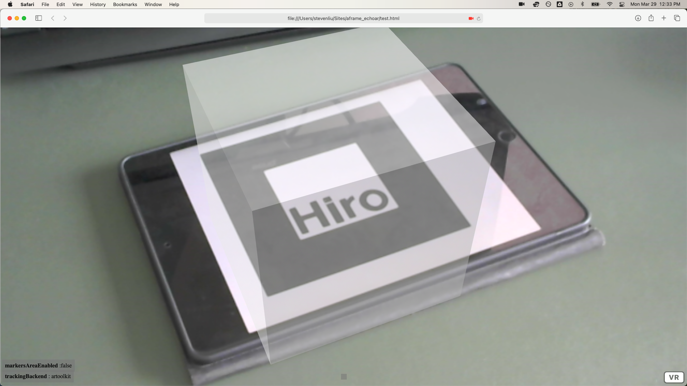
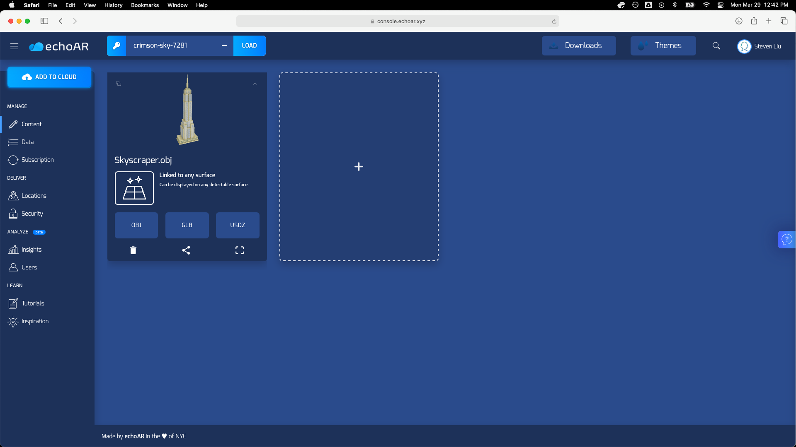
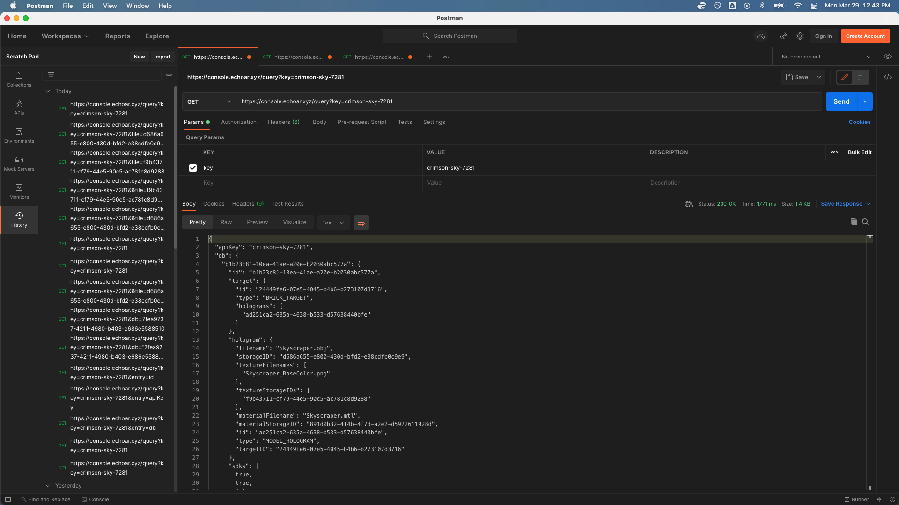
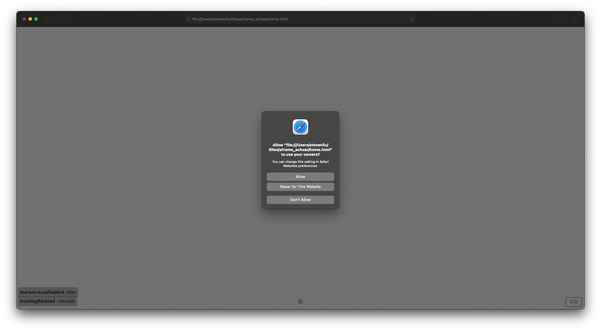
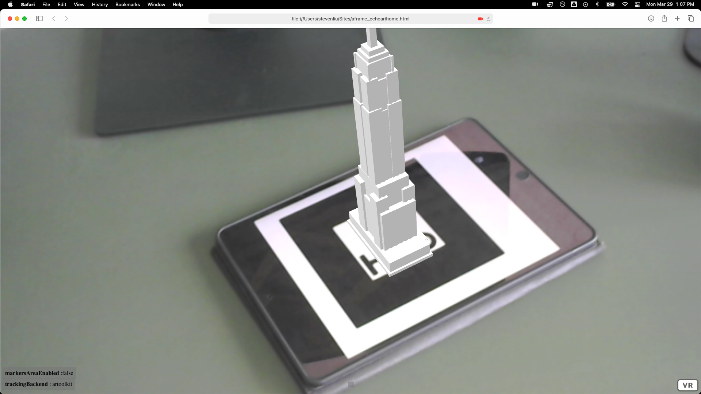

# echoAR & A-Frame Demo 

This is a very short & fun tutorial to demonstrate how to use echoAR in [A-Frame](https://aframe.io/) (an widely-used open-source web framework) with the help of [AR.js](https://github.com/AR-js-org). 

## Preview

Throughout the tutorial, we'll integrate echoAR with A-Frame and AR.js. What do we end up with? A staggeringly-fast-to-build VR application that can run on almost all existing platforms (even on older phones). By just opening the browser, you will see the 3D object displayed on your camera – without using any third party apps.



## Register
If you don't have an echoAR API key yet, make sure to register for FREE at [echoAR](https://console.echoar.xyz/#/auth/register).

## Tutorials we'll look at

First of all, let's start with a few tutorials:

[HTML](https://developer.mozilla.org/en-US/docs/Learn/HTML/Introduction_to_HTML/Getting_started): In case you haven't used HTML for a while, here's a refresher.

[A-Frame](https://aframe.io/docs/1.2.0/introduction/): After reading this tutorial, you'll have an idea about what A-Frame is and how to use it. We'll need [Introduction](https://aframe.io/docs/1.2.0/introduction/), [Installation](https://aframe.io/docs/1.2.0/introduction/installation.html), and [Entity-Component-System](https://aframe.io/docs/1.2.0/introduction/entity-component-system.html) for this tutorial, but feel free to dive deeper.

[echoAR Object](https://docs.echoar.xyz/objects) and [API](https://docs.echoar.xyz/queries): we'll use API calls to access files on your echoAR console. Make sure you read them all before we get started.

[Using 3D models with AR.js and A-Frame](https://medium.com/@akashkuttappa/using-3d-models-with-ar-js-and-a-frame-84d462efe498): A very useful article for using AR.js with A-Frame.

## Get Started with A-Frame
A simple A-Frame project can be a single HTML file no longer than 10 lines:
```
<html>
  <head>
    <script src="https://aframe.io/releases/1.2.0/aframe.min.js"></script>
  </head>
  <body>
    <a-scene>
      <a-box position="-1 0.5 -3" rotation="0 45 0" color="#4CC3D9"></a-box>
    </a-scene>
  </body>
</html>
```
By opening the file, you will see the box in your browser:



## Use AR.js in A-Frame
Now, let's use [AR.js in A-Frame](https://aframe.io/blog/arjs/). We'll use the open sourse [code](https://github.com/jeromeetienne/ar.js) provided by [Jerome Etienne](https://twitter.com/jerome_etienne) by including

```
<script src="https://jeromeetienne.github.io/AR.js/aframe/build/aframe-ar.js"></script>
```
Then we define an A-Frame scene with a box and a marker camera in the body:
```
<html>
  <script src="https://aframe.io/releases/1.2.0/aframe.min.js"></script>
  <script src="https://jeromeetienne.github.io/AR.js/aframe/build/aframe-ar.js"></script>
                                                                    
  <body style='margin : 0px; overflow: hidden;'>
    <a-scene embedded arjs='sourceType: webcam;'>
        <a-marker preset='hiro'>
          <a-box position="0 0 0" material='opacity: 0.5;'></a-box>
        </a-marker> 
        <a-entity camera> </a-entity>
    </a-scene>
  </body>
</html>
```

In case you are wondering, "hiro" is the [preset marker](https://github.com/jeromeetienne/AR.js/blob/master/data/images/hiro.png). You will need to show your camera an image of the marker so that it knows where to place your 3D object.



You can also customize your marker by following [this tutorial](https://medium.com/arjs/how-to-create-your-own-marker-44becbec1105).

Now we look at how to use echoAR in A-Frame.

## A Look into the echoAR API Calls
Assuming that you have "Skyscraper.obj" on your console, like this:



You can use 
```
https://console.echoAR.xyz/query?key=<API_KEY>
```
retrieve a data set of entries associated with your API key. Read more about API calls [here](https://docs.echoar.xyz/objects).

You can use Postman to try it out yourself. Using the GET method, you'll see something like this:


In "hologram", you'll see "storageID" and "textureStorageIDs". We will need them to retrieve the OBJ file and the material file.

To download a file stored in the system, use
```
https://console.echoAR.xyz/query?key=<API_KEY>&file=<FILE_STORAGE_ID>
```
In this case, my API key is "crimson-sky-7281", my "storageID" is "d686a655-e800-430d-bfd2-e38cdfb0c9e9", and my "textureStorageIDs" is "f9b43711-cf79-44e5-90c5-ac781c8d9288". Thus, I use this query to get the OBJ file:
```
https://console.echoar.xyz/query?key=crimson-sky-7281&file=d686a655-e800-430d-bfd2-e38cdfb0c9e9
```

and this query to for the material file:
```
https://console.echoar.xyz/query?key=crimson-sky-7281&file=f9b43711-cf79-44e5-90c5-ac781c8d9288
```

## Almost Done!
With these two queries, you can create an A-Frame entity like this to use your echoAR objects:
```
<a-entity 
    obj-model="obj: url(<YOUR_OBJ_QUERY>);
    mtl: url(<YOUR_MATERIAL_QUERY>)"
    position='0 0 0' 
    scale = '0.05 0.05 0.05'
</a-entity>
```

So we ended up with the code below:
```
<html>
  <script src="https://aframe.io/releases/1.2.0/aframe.min.js"></script>
  <script src="https://jeromeetienne.github.io/AR.js/aframe/build/aframe-ar.js"></script>
                                                                                 
  <body style='margin : 0px; overflow: hidden;'>
    <a-scene embedded arjs='sourceType: webcam;'>
        <a-marker preset='hiro'>
          <a-entity 
              obj-model="obj: url(https://console.echoar.xyz/query?key=crimson-sky-7281&file=d686a655-e800-430d-bfd2-e38cdfb0c9e9);
              mtl: url(https://console.echoar.xyz/query?key=crimson-sky-7281&file=f9b43711-cf79-44e5-90c5-ac781c8d9288)"
              position='0 0 0' 
              scale = '0.05 0.05 0.05'
          </a-entity>
        </a-marker> 
        <a-entity camera> </a-entity>
    </a-scene>
  </body>
</html>
```

## Run
Now, simply click on ```home.html``` to open in your browser and grant camera permissions.


There you go!



## Debug
If you can't see your object, your 3D object is most definitely too large. In this case, try to downsize the object.

## Support
Feel free to reach out at [support@echoAR.xyz](mailto:support@echoAR.xyz) or join our [support channel on Slack](https://join.slack.com/t/echoar/shared_invite/enQtNTg4NjI5NjM3OTc1LWU1M2M2MTNlNTM3NGY1YTUxYmY3ZDNjNTc3YjA5M2QyNGZiOTgzMjVmZWZmZmFjNGJjYTcxZjhhNzk3YjNhNjE). 