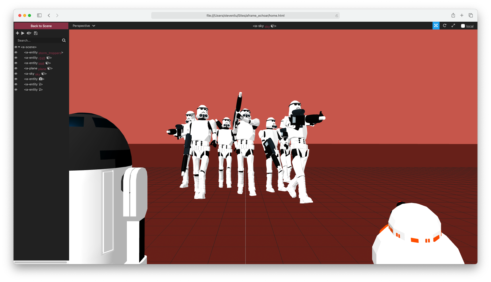

# **Using echoAR with A-Frame**

## Intro

This is a very short & fun tutorial to demonstrate how to use echoAR in [A-Frame](https://aframe.io/) (an widely-used open-source web framework). What do we end up with? An AR application that can run on almost all existing platforms (even on older phones) without using any third party apps.

## Register
If you don't have an echoAR API key yet, make sure to register for FREE at [echoAR](https://console.echoar.xyz/#/auth/register).

## Useful Links

First of all, let's start with a few tutorials:

[HTML](https://developer.mozilla.org/en-US/docs/Learn/HTML/Introduction_to_HTML/Getting_started): In case you haven't used HTML for a while, here's a refresher.

[A-Frame](https://aframe.io/docs/1.2.0/introduction/): After reading this tutorial, you'll have an idea about what A-Frame is and how to use it. We'll need [Introduction](https://aframe.io/docs/1.2.0/introduction/), [Installation](https://aframe.io/docs/1.2.0/introduction/installation.html), and [Entity-Component-System](https://aframe.io/docs/1.2.0/introduction/entity-component-system.html) for this tutorial, but feel free to dive deeper.

[echoAR Object](https://docs.echoar.xyz/objects) and [API](https://docs.echoar.xyz/queries): we'll use API calls to access files on your echoAR console. Make sure you read them all before we get started.

[A-Frame Visual Inspector & Dev Tools](https://aframe.io/docs/1.2.0/introduction/visual-inspector-and-dev-tools.html#a-frame-inspector): tools that will improve VR development experience with A-Frame.

## Getting Started with A-Frame
A simple A-Frame project can be a single HTML file no longer than 10 lines:
```
<html>
  <head>
    <script src="https://aframe.io/releases/1.2.0/aframe.min.js"></script>
  </head>
  <body>
    <a-scene>
      <a-box position="-1 0.5 -3" rotation="0 45 0" color="#4CC3D9"></a-box>
    </a-scene>
  </body>
</html>
```
You can add more objects inside the a-scene if you want. After opening the file, you will see a blue box in your browser:


## A Look into the echoAR API Calls
Now we are ready to look at how to use echoAR in A-Frame. Assuming that you have "Skyscraper.obj" on your console, like this:


You can use 
```
https://console.echoAR.xyz/query?key=<API_KEY>
```
to retrieve a data set of entries associated with your API key. Read more about API calls [here](https://docs.echoar.xyz/objects).

You should use [Postman](https://www.postman.com) and try it out yourself. Using the GET method, you'll see something like this:


In "additionalData", you'll see "glbHologramStorageID". We will need it to retrieve the GLB file. Note that A-Frame supports GLB best, and file formats like OBJ may cause problems including missing texture (since file structures may be different).

To download a file stored in the system, use
```
https://console.echoAR.xyz/query?key=<API_KEY>&file=<FILE_STORAGE_ID>
```
In this case, my API key is "crimson-sky-7281" and the "glbHologramStorageID" of "Skyscraper.obj" is "d686a655-e800-430d-bfd2-e38cdfb0c9e9.glb". Thus, I use this query to get the GLB file:
```
https://console.echoar.xyz/query?key=crimson-sky-7281&file=d686a655-e800-430d-bfd2-e38cdfb0c9e9.glb
```

## Almost Done!
With these two queries, you can create an A-Frame entity like this to use your echoAR objects:
```
<a-entity 
    gltf-model="url(<YOUR_GLB_FILE_QUERY>)"
    position='0 0 0' 
    scale = '0.05 0.05 0.05'
    rotation = "0 -90 0"
</a-entity>
```

Here, I used three few Star Wars themed objects: 
<p float="left">
  
   
  

and the code looks like this:

```
<html>
  <head>
    <script src="https://aframe.io/releases/1.2.0/aframe.min.js"></script>
  </head>

  <body>
    <a-scene>
      <!-- Storm Troopers -->
      <a-entity id="storm_troppers" position="-1.8 1.5 -5" gltf-model="url(https://console.echoar.xyz/query?key=crimson-sky-7281&file=e51e54c3-c14c-4d67-b69f-2fe2ef7973c5.glb)" position = '-1.2 1.5 -5' scale = '2 2 2'></a-entity>

      <!-- R2D2 -->
      <a-entity id="r2d2" gltf-model="url(https://console.echoar.xyz/query?key=crimson-sky-7281&file=6ddab898-f190-41cf-9a1a-e06499083db3.glb)" position = '-0.05 1.52 0.2' scale = '0.01 0.01 0.01' rotation = "0 90 0"></a-entity>

      <!-- BB-8 -->
      <a-entity id="bb8" gltf-model="url(https://console.echoar.xyz/query?key=crimson-sky-7281&file=98e0a92e-8598-4afd-a925-d6f273a194db.glb)" position = '0.04 1.4 0.18' scale = '0.1 0.1 0.1' rotation = "0 -90 0"></a-entity>
      
      <!-- Ground -->
      <a-plane id="plane" position="0 0 0" rotation="-90 0 0" width="1000" height="1000" color="#641E16"></a-plane>
      
      <!-- Sky -->
      <a-sky id="sky" color="#CD6155"></a-sky>
    </a-scene>
  </body>
</html>
```

## Run
Now, simply click on ```home.html``` to to view the scene in your browser.


## A-Frame Inspctor

You can use the A-Frame Inspector to inspect and tweak scenes – that means moving, rotating, and rescaling the entities in the scene and seeing the result at real time. (Thus, you don't have to change the HTML file and recompile every time, which can be very annoying and inefficient.)

To try it out, you should specify a build of the Inspector in the scene like this:
```
<a-scene inspector="https://cdn.jsdelivr.net/gh/aframevr/aframe-inspector@master/dist/aframe-inspector.min.js">
  <!-- ... -->
</a-scene>
```

So our code now looks like this:
```
<html>
  <head>
    <script src="https://aframe.io/releases/1.2.0/aframe.min.js"></script>
  </head>

  <body>
    <a-scene inspector="https://cdn.jsdelivr.net/gh/aframevr/aframe-inspector@master/dist/aframe-inspector.min.js">
      <!-- Storm Troopers -->
      <a-entity id="storm_troppers" position="-1.76541 1.56728 -4.94071" gltf-model="url(https://console.echoar.xyz/query?key=crimson-sky-7281&file=e51e54c3-c14c-4d67-b69f-2fe2ef7973c5.glb)" position = '-1.2 1.5 -5' scale = '2 2 2'></a-entity>
      
      <!-- R2D2 -->
      <a-entity id="r2d2" scale="0.1 0.1 0.1" position="-0.9701 0.87613 0.98051" gltf-model="url(https://console.echoar.xyz/query?key=crimson-sky-7281&file=6ddab898-f190-41cf-9a1a-e06499083db3.glb)" position = '-0.05 1.52 0.2' scale = '0.01 0.01 0.01' rotation = "0 90 0"></a-entity>
      
      <!-- BB-8 -->
      <a-entity id="bb8" visible="true" scale="1 1 1" position="0.04 -0.19389 0.1802" gltf-model="url(https://console.echoar.xyz/query?key=crimson-sky-7281&file=98e0a92e-8598-4afd-a925-d6f273a194db.glb)" position = '0.04 1.4 0.18' scale = '0.1 0.1 0.1' rotation = "0 -90 0"></a-entity>
      
      <!-- Ground -->
      <a-plane id="plane" position="0 0 0" rotation="-90 0 0" width="1000" height="1000" color="#641E16"></a-plane>
      
      <!-- Sky -->
      <a-sky id="sky" color="#CD6155"></a-sky>
    </a-scene>
  </body>
</html>
```

Then, you can press ```<ctrl> + <alt> + i``` on the browser page to enter the A-Frame Inspector. However, if you don't have aframe-watcher installed locally, you won't be able to modify the HTML file from the inspector.

So, let's install aframe-watcher:
```
npm install -g aframe-watcher
```

Then, navigate to your project folder and start it:
```
aframe-watcher
```

Alternatively, you can specify which HTML file to use:
```
aframe-watcher home.html
```

Then the aframe-watcher will start watching for changes from the Inspector:


Now we are ready to enter the A-Frame Inspector. Simply press ```<ctrl> + <alt> + i``` on the browser page:



You can see all entities are listed on the left. If we click on one of the entities on the list (or simply click on the entity in the scene), we'll be able to select the entity and see its attributes (e.g., position, rotation, scale, and even link to the gltf-model). You can also move the entities around by dragging on an axis.


When you're done moving your entities around, you might want to save the file. Just click on the button on the upperleft:


and then navigate to your Terminal. It'll prompt you to confirm the changes:


Now, if you go to your HTML file, you'll find that all the attributes you modified from the Inspector are updated.

To know more about Inspector and other tools, navigate to A-Frame's [tutorial](https://aframe.io/docs/1.2.0/introduction/visual-inspector-and-dev-tools.html#a-frame-inspector). 


## Debug
- If you can't see your objects, most likely they are too large. Try to scale them down.

- Note that aframe-watcher can only update entities that have defined IDs, so if your changes are not saved, you might forgot adding an ID to your entities. You can add IDs like this:
  ```
  <a-entity id="<ID_OF_YOUR_ENTITY>"></a-entity>
  ```

- If you see this message, that means you did not install your aframe-watcher properly. In this case, reinstall and try again.
  
  

## Support
Feel free to reach out at [support@echoAR.xyz](mailto:support@echoAR.xyz) or join our [support channel on Slack](https://join.slack.com/t/echoar/shared_invite/enQtNTg4NjI5NjM3OTc1LWU1M2M2MTNlNTM3NGY1YTUxYmY3ZDNjNTc3YjA5M2QyNGZiOTgzMjVmZWZmZmFjNGJjYTcxZjhhNzk3YjNhNjE). 


#### By Steven Liu
#### April 3, 2021