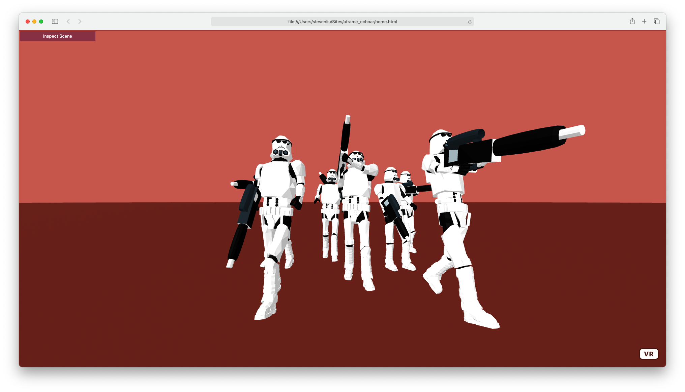

# echoAR & A-Frame Demo 

This is a very short & fun tutorial to demonstrate how to use echoAR in [A-Frame](https://aframe.io/) (an widely-used open-source web framework) with the help of [AR.js](https://github.com/AR-js-org). 

## Preview

Throughout the tutorial, we'll integrate echoAR with A-Frame and AR.js. What do we end up with? A staggeringly-fast-to-build VR application that can run on almost all existing platforms (even on older phones). By just opening the browser, you will see the 3D object displayed on your camera – without using any third party apps.


(Here's a screenshot of what we'll achieve. Sorry for the dirty screen. I promise I'll wipe it and upload a better looking one.)

## Register
If you don't have an echoAR API key yet, make sure to register for FREE at [echoAR](https://console.echoar.xyz/#/auth/register).

## Tutorials we'll look at

First of all, let's start with a few tutorials:

[HTML](https://developer.mozilla.org/en-US/docs/Learn/HTML/Introduction_to_HTML/Getting_started): In case you haven't written any HTML recently, here's a refresher.

[A-Frame](https://aframe.io/docs/1.2.0/introduction/): After looking at this tutorial, you'll have an idea about what A-Frame is and how the framework looks like. We'll need [Introduction](https://aframe.io/docs/1.2.0/introduction/), [Installation](https://aframe.io/docs/1.2.0/introduction/installation.html), and [Entity-Component-System](https://aframe.io/docs/1.2.0/introduction/entity-component-system.html) for this tutorial, but feel free to dive deeper.

[echoAR Object](https://docs.echoar.xyz/objects) and [echoAR API](https://docs.echoar.xyz/queries): we'll use API calls extensively in this tutorial. Make sure you read them all before we get started.

[Using 3D models with AR.js and A-Frame](https://medium.com/@akashkuttappa/using-3d-models-with-ar-js-and-a-frame-84d462efe498): This is a very useful article for using AR.js with A-Frame. Our tutorial here will be based on this article.

## Get Started with A-Frame
TBD

## Use AR.js in A-Frame
https://aframe.io/blog/arjs/

## A Look into the echoAR API
Postman

## Get the Object files in HTML
TBD

## Resize & Relocate
TBD

## Run
We are done. Now, simply click on ```home.html``` to open in your browser and grant camera permissions.

There you go!

## Debug
If you can't see your object, your 3D object is most definitely too large. In this case, try to downsize the object like this (we use scale 0.05 here):
```
<a-entity 
    obj-model="obj: url(https://console.echoar.xyz/query?key=<YOUR_KEY>&file=<YOUR_FILE_ADDRESS>);
    mtl: url(https://console.echoar.xyz/query?key=<YOUR_KEY>&file=<YOUR_MTL_FILE_ADDRESS>)"
    position='0 0 0' 
    scale = '0.05 0.05 0.05'
</a-entity>
```

## Support
Feel free to reach out at [support@echoAR.xyz](mailto:support@echoAR.xyz) or join our [support channel on Slack](https://join.slack.com/t/echoar/shared_invite/enQtNTg4NjI5NjM3OTc1LWU1M2M2MTNlNTM3NGY1YTUxYmY3ZDNjNTc3YjA5M2QyNGZiOTgzMjVmZWZmZmFjNGJjYTcxZjhhNzk3YjNhNjE). 